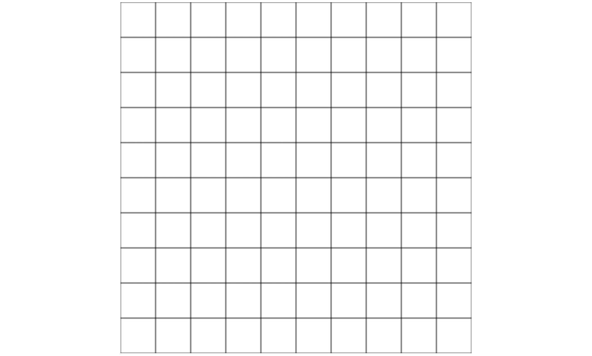

# JS | Canvas Treasure Hunt

## Introduciton

You would like to implement a simple treasure hunt.

## Iteration 1

The goal is to reproduce the following grid.



For this, you will need to create a file `index.html` with the following code:

```html
<!DOCTYPE html>
<html lang="en">
<head>
  <meta charset="UTF-8">
  <meta name="viewport" content="width=device-width, initial-scale=1.0">
  <meta http-equiv="X-UA-Compatible" content="ie=edge">
  <title>JS | Canvas Treasure Hunt</title>
  <link rel="stylesheet" href="style.css">
</head>
<body>
  <canvas width="500" height="500"></canvas>
  <script src="main.js"></script>
</body>
</html>
```

You will also have to create a file `main.js` like the following one:
```js
var canvas = document.querySelector('canvas')
var ctx = canvas.getContext('2d')
var width = canvas.width
var height = canvas.height

// Iteration 1
function drawGrid() {
  // TODO: write the code of the function
}

drawGrid()
```

To finish this iteration, you have to code the code of the function `drawGrid`.

## Iteration 2

Now, you have to create a class `Character`. You should define at least:
- a `col` property
- a `row` property
- a `moveUp()` method
- a `moveRight()` method
- a `moveDown()` method
- a `moveLeft()` method

You have below an example of what you should happen.
```js
var player = new Character(0,0) // (0,0) = Initial position
player.moveDown() // Increase by 1 the value of player.row
player.moveDown() // Increase by 1 the value of player.row
player.moveRight() // Increase by 1 the value of player.col
console.log(player.col, player.row) // => 1,2
```

## Iteration 3 

Create a function `drawPlayer` that displays the `player` on the canvas based on its `col` and `row` values.

You can only use `images/character-down.png` for this iteration.


## Iteration 4
- Create a class `Treasure` with a method `setRandomPosition()` and a property `col` and `row`
- Create a function `drawTreasure()` that displays the treasure on the canvas. The picture is `images/treasure.png`

## Iteration 5
Listen for keydown events to:
- Update the player coordinates
- Draw everything again

For this you take inspiration of the following code.
```js
document.onkeydown = function(e) {
  e.preventDefault() // Stop the default behavior (moving the screen to the left/up/right/down)
  switch (e.keyCode) {
    case 37: console.log('left');  break;
    case 38: console.log('up');    break;
    case 39: console.log('right'); break;
    case 40: console.log('down');  break;
  }
}
```

## Iteration 6
Do what you want to make this game awesome!

